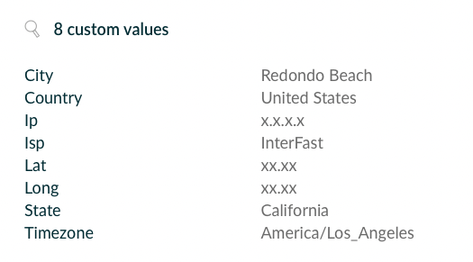

# Ip Info
Extends the Build Scan information adding Geolocation data(retrieved from https://ip-api.com) as custom values.
The data included is:
* country
* regionName
* city
* lat
* long
* timeZone
* isp
* query

The execution is wrapped with a `ValueSource` and is compatible with Configuration Cache

## Usage
Apply the plugin in the main `build.gradle(.kts)` configuration file:

#### Kotlin
Using the plugins DSL:
``` groovy
plugins {
  id("io.github.cdsap.ipinfo") version "0.1"
}
```

Using legacy plugin application:
``` groovy
buildscript {
  repositories {
    gradlePluginPortal()
  }
  dependencies {
    classpath("io.github.cdsap:ipinfo:0.1")
  }
}

apply(plugin = "io.github.cdsap.ipinfo")
```

#### Groovy
Using the plugins DSL:
``` groovy
plugins {
  id "io.github.cdsap.ipinfo" version "0.1"
}

```

Using legacy plugin application:
``` groovy
buildscript {
  repositories {
    gradlePluginPortal()
  }
  dependencies {
    classpath "io.github.cdsap:ipinfo:0.1"
  }
}

apply plugin: "io.github.cdsap.ipinfo"
```
## Output Build Scans




## Requirements
* Gradle 7.5

## Libraries
* com.gradle.enterprise:com.gradle.enterprise.gradle.plugin
